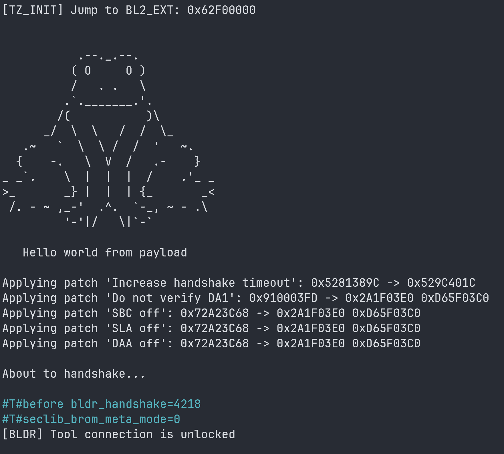

# sprig

<p align="center">
  
</p>

## What and why

This is yet another example of what one can do with the underlying "vulnerability" used in my other project, [fenrir](https://github.com/R0rt1z2/fenrir).

This is a tiny replacement for the `bl2_ext` image inside the LK partition of modern ARMv8 MediaTek devices.

This PoC runs in an EL3 context and patches the Preloader in memory to disable SBC (Secure Boot Control), SLA (Serial Link Authentication), and DAA (Download Agent Authentication) checks.

This allows booting unsigned DAs using tools like `penumbra` or `mtkclient`, allowing you to arbitrarily flash and dump partitions, as well as unrestricted memory dumping.

After patching, execution jumps back to the Preloader handshake handler, which expects you to connect using these tools.

Note that you should not confuse this with the original port exposed by the Preloader before the payload runs.

As a result, you will see two Preloader ports: the first one disappears within ~2 seconds, while the second one (exposed after the payload patches the Preloader) remains available for around 8 seconds to give you time to connect with your flashing tool.

## Building

Building requires the `aarch64-none-elf-gcc` toolchain. The provided script automatically downloads and installs the toolchain if it is not already present on your system:

```bash
./build.sh
```

## Injecting

To use this, you must inject the resulting payload into the LK image. This can be done using the provided Python script:

```bash
python3 inject.py bin/lk.img payload/payload.bin patched_lk.bin
```

Then, flash the resulting `patched_lk.bin` to the LK partition of your device using your preferred tool (e.g. `mtkclient` or `penumbra`) and reboot.

Note that the device will not boot normally and will remain "bricked" until you restore the original LK image, as this payload is not capable of continuing the normal boot process (for now).

## Notes

LK has multiple sub-partitions. The Preloader loads the `bl2_ext` sub-partition while still running in EL3, after which `bl2_ext` drops to EL1 and continues the boot chain.

Generally, `bl2_ext` is loaded at `0x62F00000` and has its own mblock defined as `system_bl2-ext` with a size of `0x2000000`.

The end of its stack appears to be at `0x62FD2000`. On Pacman (Nothing Phone 2A), the sub-partition itself has a size of `0xA0EA8` bytes.

`bl2_ext` seems to operate entirely in the physical address space at EL3 (compiled without `WITH_KERNEL_VM`).

The exception vector base (`VBAR_EL3`) is set to `0x62F02000`, which is a physical address within `bl2_ext`'s loaded region.

Cache sharing is disabled before the privilege drop. This means that any patches to Preloader memory (at `0x201000`) require explicit cache maintenance before jumping back. Otherwise, the patches will not be visible to the Preloader due to cache isolation.

## License

This payload is licensed under the AGPL-3.0-or-later License, copyright (C) 2026 R0rt1z2. See the [LICENSE](LICENSE) file for details.